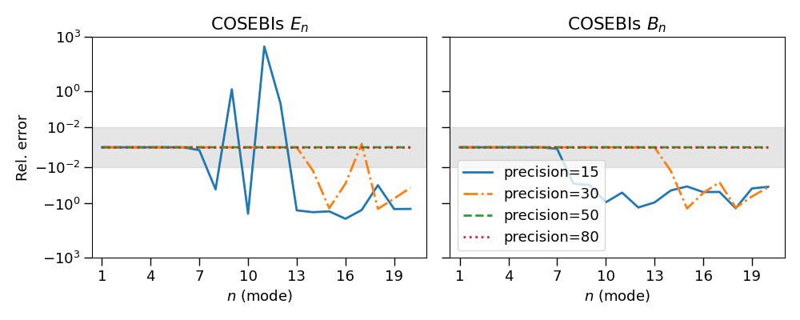

# Summary

Cosmic shear important probe. B-modes computation as null test
This software propose at the same time a user friendly interface and fast
computation for E-/B-mode decomposition.

# Statement of need

`Cosmo-numba` facilitate the computation of E-/B-modes decomposition using two
methods. One of them is the Complete Orthogonal Sets of E-/B-mode Integrals
(COSEBIs) as presented in @Schneider_2010. The COSEBIs rely on very high
precision computation requirering more than 80 decimal numbers. @Schneider_2010
propose an implementation using `mathematica`. `cosmo-numba` make use of
combination of `sympy` and `mpmath` to reach the required precision. This
python version enable an easier integration in cosmology pipeline and facilate
the null tests.

This software package also include the computation of the  pure-mode
correlation functions presented in @Schneider_2022. Those integrals have less
constraints than the COSEBIs but having a fast computation is necessary to
computing the covariance matrix. One can also include use those correlation
function for cosmological inference in which case the multiple call to the
likelihood will also require a fast implementation.

# COSEBIs

The COSEBIs are defined as:

\begin{equation}
E_{n} = \frac{1}{2} \int_{0}^{\infty} d\theta \theta [T_{n,+}(\theta)\xi_{+}(\theta) + T_{n,-}(\theta)\xi_{+}(\theta)],
\end{equation}
\begin{equation}
B_{n} = \frac{1}{2} \int_{0}^{\infty} d\theta \theta [T_{n,+}(\theta)\xi_{+}(\theta) - T_{n,-}(\theta)\xi_{+}(\theta)];
\end{equation}

where $\xi_{\pm}(\theta)$ are the shear correlation functions, and $T_{n,\pm}$
are the weight functions for the mode $n$. The complexity is in the computation
of reside in the computation of the weight functions. `Cosmo-numba` include do
the computation of the weight functions in logarithmic scale defined by:

\begin{equation}
T_{n,+}^{\rm{log}}(\theta) = t_{n,+}^{\rm{log}}(z) = N_{n}\sum_{j=0}^{n+1}\bar{c}_{nj}z^{j};
\end{equation}

whare $z = log(\theta/\theta_{\rm{min}})$, $N_{n}$ is the normalization for the
mode $n$, and $\bar{c}_{jn}$ are defined iterratively from Bessel functions
(we refer the readers to @Schneider_2010 for morre details).

We have validating our implementation against the original version in
`Mathematica` from @Schneider_2010. In figure \autoref{fig:Tpm_prec} we show
the impact of the precsion going from 15 decimals, which correspond to the
precision one could achieve using float64, up to 80, the precision used in the
original implementation. We can see that classic float64 precision would not be
suficient and with a precision of 80 our code recover exactly the results from
the orignal implementation. Similarly, the impact on the COSEBIs is shown in
figure \autoref{fig:EB_prec}.

COSEBIs can also be defined from the power spectrum as:

\begin{equation}
E_{n} = \int_{0}^{\infty} \frac{d \ell \ell}{Z \pi} P_{E}(\ell)W_{\ell};
\end{equation}
\begin{equation}
B_{n} = \int_{0}^{\infty} \frac{d \ell \ell}{Z \pi} P_{B}(\ell)W_{\ell};
\end{equation}

where $P_{E/B}(\ell)$ is the power spectrum of E- and B-modes and $W_{n}(\ell)$
are the filter functions which can be computed from $T_{n,+}$ as:

\begin{equation}\label{eq:Wn}
W_{n}(\ell) = \int_{\theta_{min}}^{\theta_{max}} d\theta \theta T_{n,+}(\theta) J_{0}(\ell \ell);
\end{equation}

with $J_{0}(\ell \ell)$ the 0-th order Bessel function. The \autoref{eq:Wn} is
an Hankel transform of order 0. It can be computed using the `FFTLog` algorithm
presented in @Hamilton_2000 implemented here in `Numba`. The
\autoref{fig:cosebis_xi_cl} shows the comparison between the COSEBIs computed
from $\xi_{\pm}(\theta)$ and from $C_{E/B}(\ell)$. We can see that the COSEBIs
E-modes agrees very well but the B-modes are more stable when computed from the
$C(\ell)$ space.

# Pure-Mode Correlation Functions

In this section we look into the computation of the pure-mode correlation
functions as defined in @Schneider_2022. There are defined as follow:

\begin{equation}
\xi_{+}^{E}(\vartheta) = \frac{1}{2} \left[ \xi_{+}(\vartheta) + \xi_{-}(\vartheta) + \int_{\vartheta}^{\vartheta_{\rm{max}}} \frac{d \theta}{\theta} \xi_{-}(\theta) \left( 4 - \frac{12\vartheta^{2}}{\theta^{2}} \right) \right] - \frac{1}{2} \left[ S_{+}(\vartheta) + S_{-}(\vartheta)\right],
\end{equation}
\begin{equation}
\xi_{+}^{B}(\vartheta) = \frac{1}{2} \left[ \xi_{+}(\vartheta) - \xi_{-}(\vartheta) - \int_{\vartheta}^{\vartheta_{\rm{max}}} \frac{d \theta}{\theta} \xi_{-}(\theta) \left( 4 - \frac{12\vartheta^{2}}{\theta^{2}} \right) \right] - \frac{1}{2} \left[ S_{+}(\vartheta) - S_{-}(\vartheta)\right],
\end{equation}

\begin{equation}
\xi_{-}^{E}(\vartheta) = \frac{1}{2} \left[ \xi_{+}(\vartheta) + \xi_{-}(\vartheta) + \int_{\vartheta_{\rm{min}}}^{\vartheta} \frac{d \theta\~\theta}{\vartheta^{2}} \xi_{+}(\theta) \left( 4 - \frac{12\theta^{2}}{\vartheta^{2}} \right) \right] - \frac{1}{2} \left[ V_{+}(\vartheta) + V_{-}(\vartheta)\right],
\end{equation}
\begin{equation}
\xi_{-}^{B}(\vartheta) = \frac{1}{2} \left[ \xi_{+}(\vartheta) - \xi_{-}(\vartheta) + \int_{\vartheta_{\rm{min}}}^{\vartheta} \frac{d \theta\~\theta}{\vartheta^{2}} \xi_{+}(\theta) \left( 4 - \frac{12\theta^{2}}{\vartheta^{2}} \right) \right] - \frac{1}{2} \left[ V_{+}(\vartheta) - V_{-}(\vartheta)\right];
\end{equation}

where $\xi_{\pm}(\theta)$ correspond to the shear-shear correlation function.
The functions $\S_{\pm}(\theta)$ and $V_{\pm}(\theta)$ are themselves defined
by integrals and we refer the reader to @Schneider_2022 for more details about
their definition. By contrast with the computation of the COSEBIs, these
integrals are more stable and strainghtforward to compute but still requires
some level of precision. This is why we are using the `quads` method with a
5-th order spline interpolation. In addtition, as one can see from the
equations above, the implementation will require to loop over a range of
$\vartheta$. This is why having a fast implementation will be required if one
want to use those correlation functions in cosmological inference for instance.

# Acknowledgements

# References
