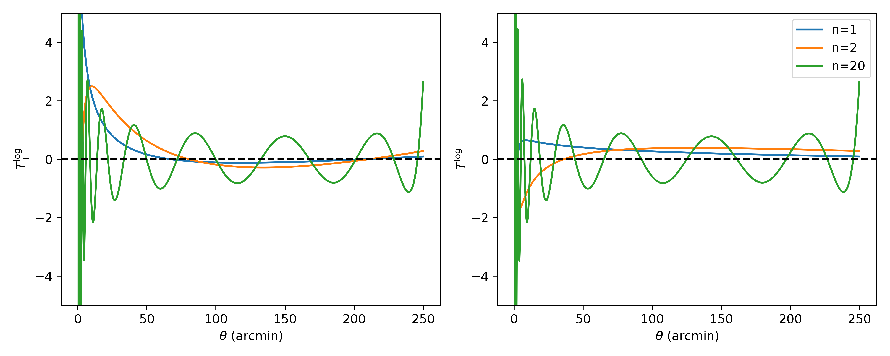

# Summary

Cosmic shear important probe. B-modes computation as null test
This software propose at the same time a user friendly interface and fast
computation for E-/B-mode decomposition.

# Statement of need

`Cosmo-numba` facilate the computation of E-/B-modes decomposition using two
methods. One of them is the Complete Orthogonal Sets of E-/B-mode Integrals
(COSEBIs) as presented in @Schneider_2010. The COSEBIs rely on very high
precision computation requirering more than 80 decimal numbers. @Schneider_2010
propose an implementation using `mathematica`. `cosmo-numba` make use of
combination of `sympy` and `mpmath` to reach the required precision. This
python version enable an easier integration in cosmology pipeline and facilate
the null tests.

This software package also include the computation of the  pure-mode
correlation functions presented in @Schneider_2022. Those integrals have less
constraints than the COSEBIs but having a fast computation is necessary to
computing the covariance matrix. One can also include use those correlation
function for cosmological inference in which case the multiple call to the
likelihood will also require a fast implementation.

# COSEBIs

The COSEBIs are defined as:

\begin{equation}
E_{n} = \frac{1}{2} \int_{0}^{\infty} d\theta \theta [T_{n,+}(\theta)\xi_{+}(\theta) + T_{n,-}(\theta)\xi_{+}(\theta)] \\  
B_{n} = \frac{1}{2} \int_{0}^{\infty} d\theta \theta [T_{n,+}(\theta)\xi_{+}(\theta) - T_{n,-}(\theta)\xi_{+}(\theta)]
\end{equation}

where $\xi_{\pm}(\theta)$ are the shear correlation functions, and $T_{n,\pm}$
are the weight functions for the mode $n$. The complexity is in the computation
of reside in the computation of the weight functions. `Cosmo-numba` include do
the computation of the weight functions in logarithmic scale defined by:

\begin{equation}
T_{n,+}^{\rm{log}}(\theta) = t_{n,+}^{\rm{log}}(z) = N_{n}\sum_{j=0}^{n+1}\bar{c_{nj}}z^{j}
\end{equation}

whare $z = log(\theta/\theta_{\rm{min}})$, $N_{n}$ is the normalization for the
mode $n$, and $\bar{c_{jn}}$ are defined iterratively from Bessel functions
(we refer the readers to @Schneider_2010 for morre details).

# Mathematics

Single dollars ($) are required for inline mathematics e.g. $f(x) = e^{\pi/x}$

Double dollars make self-standing equations:

$$\Theta(x) = \left\{\begin{array}{l}
0\textrm{ if } x < 0\cr
1\textrm{ else}
\end{array}\right.$$

You can also use plain \LaTeX for equations
\begin{equation}\label{eq:fourier}
\hat f(\omega) = \int_{-\infty}^{\infty} f(x) e^{i\omega x} dx
\end{equation}
and refer to \autoref{eq:fourier} from text.

# Citations

Citations to entries in paper.bib should be in
[rMarkdown](http://rmarkdown.rstudio.com/authoring_bibliographies_and_citations.html)
format.

If you want to cite a software repository URL (e.g. something on GitHub without a preferred
citation) then you can do it with the example BibTeX entry below for @fidgit.

For a quick reference, the following citation commands can be used:
- `@author:2001`  ->  "Author et al. (2001)"
- `[@author:2001]` -> "(Author et al., 2001)"
- `[@author1:2001; @author2:2001]` -> "(Author1 et al., 2001; Author2 et al., 2002)"

# Figures

Figures can be included like this:

and referenced from text using \autoref{fig:example}.

Figure sizes can be customized by adding an optional second parameter:
{ width=20% }

# Acknowledgements

We acknowledge contributions from Brigitta Sipocz, Syrtis Major, and Semyeong
Oh, and support from Kathryn Johnston during the genesis of this project.

# References
