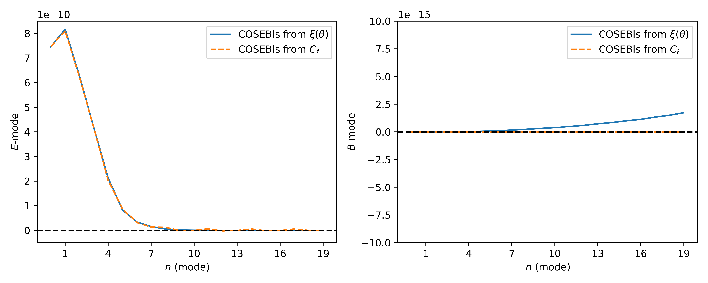

# Summary

Weak gravitational lensing is a widely used probe in cosmological analysis. It
allows astrophysists to understand the contend and evolution of the Universe.
We are entering an era where we are not limitied by the data volume but by
systematics. It is in this context that we are presenting here a simple python
based software package to help in the computation of E-/B-mode decomposition
which can be use for systematic checks or science analysis. As we demonstrate
after, our implementation has both the high precision required and speed to
perform this kind of analysis.

# Statement of need

The E-/B-mode composition for cosmic shear poses a significant computational
challenge given the need for high precision (required to integrate oscillatory
functions over a large integration range and achieve accurate results) and
speed. `Cosmo-numba` meets this need, facilitating the computation of
E-/B-modes decomposition using two methods. One of them is the Complete
Orthogonal Sets of E-/B-mode Integrals (COSEBIs) as presented in
@Schneider_2010. The COSEBIs rely on very high precision computation requiring
more than 80 decimal places. @Schneider_2010 propose an implementation using
`mathematica`. `cosmo-numba` uses a combination of `sympy` and `mpmath` to
reach the required precision. This python version enables an easier integration
within cosmological inference pipelines, which are commonly python-based, and
facilitates the null tests.

This software package also enables the computation of the  pure-mode
correlation functions presented in @Schneider_2022. Those integrals are less
numerically challenging than the COSEBIs, but having a fast computation is
necessary for computing the covariance matrix. One can also use those
correlation functions for cosmological inference, in which case the large
number of calls to the likelihood function will also require a fast
implementation.

# Testing setup

In the following two sections we will need fiducial shear-shear correlation
functions, $\xi_{\pm}(\theta)$, and power spectrum, $P_{E/B}(\ell)$. They have
been computed using the Core Cosmology Library[^1] [@Chisari_2019] developed
by the Dark Energy Science Collaboration.

[^1]: <https://github.com/LSSTDESC/CCL>

# COSEBIs

The COSEBIs are defined as:

\begin{equation}
E_{n} = \frac{1}{2} \int_{0}^{\infty} d\theta\, \theta [T_{n,+}(\theta)\xi_{+}(\theta) + T_{n,-}(\theta)\xi_{-}(\theta)],
\end{equation}
\begin{equation}
B_{n} = \frac{1}{2} \int_{0}^{\infty} d\theta\, \theta [T_{n,+}(\theta)\xi_{+}(\theta) - T_{n,-}(\theta)\xi_{-}(\theta)];
\end{equation}

where $\xi_{\pm}(\theta)$ are the shear correlation functions, and $T_{n,\pm}$
are the weight functions for the COSEBI mode $n$. The complexity is in the
computation of the weight functions. `Cosmo-numba` carries out the computation
of the weight functions in a logarithmic scale defined by:

\begin{equation}
T_{n,+}^{\rm{log}}(\theta) = t_{n,+}^{\rm{log}}(z) = N_{n}\sum_{j=0}^{n+1}\bar{c}_{nj}z^{j};
\end{equation}

whare $z = \rm{log}(\theta/\theta_{\rm{min}})$, $N_{n}$ is the normalization
for the mode $n$, and $\bar{c}_{jn}$ are defined iteratively from Bessel
functions (we refer the readers to @Schneider_2010 for more details).

We have validating our implementation against the original version in
`Mathematica` from @Schneider_2010. In \autoref{fig:Tpm_prec} we show
the impact of the precision going from 15 decimal places, which corresponds to
the precision one could achieve using float64, up to 80 decimal places, the
precision used in the original `Mathematica` implementation. We can see that
classic float64 precision would not be suficient, and with a precision of 80
our code exactly recovers the results from the original implementation.
Similarly, the impact on the COSEBIs is shown in \autoref{fig:EB_prec}.

COSEBIs can also be defined from the power spectrum as:

\begin{equation}
E_{n} = \int_{0}^{\infty} \frac{d \ell \, \ell}{2 \pi} P_{E}(\ell)W_{n}(\ell);
\end{equation}
\begin{equation}
B_{n} = \int_{0}^{\infty} \frac{d \ell \, \ell}{2 \pi} P_{B}(\ell)W_{n}(\ell);
\end{equation}

where $P_{E/B}(\ell)$ is the power spectrum of E- and B-modes and $W_{n}(\ell)$
are the filter functions which can be computed from $T_{n,+}$ as:

\begin{equation}\label{eq:Wn}
W_{n}(\ell) = \int_{\theta_{\rm{min}}}^{\theta_{\rm{max}}} d\theta \,\theta T_{n,+}(\theta) J_{0}(\ell\theta);
\end{equation}

with $J_{0}(\ell \theta)$ the 0-th order Bessel function. The \autoref{eq:Wn}
is a Hankel transform of order 0. It can be computed using the `FFTLog`
algorithm presented in @Hamilton_2000 implemented here in `Numba`.
\autoref{fig:cosebis_xi_cl} shows the comparison between the COSEBIs computed
from $\xi_{\pm}(\theta)$ and from $C_{E/B}(\ell)$. We can see that the COSEBI
E-modes agree very well but the B-modes are more stable when computed from the
$C(\ell)$ space.

# Pure-Mode Correlation Functions

In this section we describe the computation of the pure-mode correlation
functions as defined in @Schneider_2022. There are defined as follow:

\begin{equation}
\xi_{+}^{E}(\vartheta) = \frac{1}{2} \left[ \xi_{+}(\vartheta) + \xi_{-}(\vartheta) + \int_{\vartheta}^{\vartheta_{\rm{max}}} \frac{d \theta}{\theta} \xi_{-}(\theta) \left( 4 - \frac{12\vartheta^{2}}{\theta^{2}} \right) \right] - \frac{1}{2} \left[ S_{+}(\vartheta) + S_{-}(\vartheta)\right],
\end{equation}
\begin{equation}
\xi_{+}^{B}(\vartheta) = \frac{1}{2} \left[ \xi_{+}(\vartheta) - \xi_{-}(\vartheta) - \int_{\vartheta}^{\vartheta_{\rm{max}}} \frac{d \theta}{\theta} \xi_{-}(\theta) \left( 4 - \frac{12\vartheta^{2}}{\theta^{2}} \right) \right] - \frac{1}{2} \left[ S_{+}(\vartheta) - S_{-}(\vartheta)\right],
\end{equation}

\begin{equation}
\xi_{-}^{E}(\vartheta) = \frac{1}{2} \left[ \xi_{+}(\vartheta) + \xi_{-}(\vartheta) + \int_{\vartheta_{\rm{min}}}^{\vartheta} \frac{d \theta\~\theta}{\vartheta^{2}} \xi_{+}(\theta) \left( 4 - \frac{12\theta^{2}}{\vartheta^{2}} \right) \right] - \frac{1}{2} \left[ V_{+}(\vartheta) + V_{-}(\vartheta)\right],
\end{equation}
\begin{equation}
\xi_{-}^{B}(\vartheta) = \frac{1}{2} \left[ \xi_{+}(\vartheta) - \xi_{-}(\vartheta) + \int_{\vartheta_{\rm{min}}}^{\vartheta} \frac{d \theta\~\theta}{\vartheta^{2}} \xi_{+}(\theta) \left( 4 - \frac{12\theta^{2}}{\vartheta^{2}} \right) \right] - \frac{1}{2} \left[ V_{+}(\vartheta) - V_{-}(\vartheta)\right];
\end{equation}

where $\xi_{\pm}(\theta)$ correspond to the shear-shear correlation function.
The functions $S_{\pm}(\theta)$ and $V_{\pm}(\theta)$ are themselves defined
by integrals and we refer the reader to @Schneider_2022 for more details about
their definition. By contrast with the computation of the COSEBIs, these
integrals are more stable and straightforward to compute but still require
some level of precision. This is why we are using the `qags` from the
QUADPACK[^2] [@piessens2012quadpack] method with a 5-th order spline
interpolation. In addition, as one can see from the equations above, the
implementation requires a loop over a range of $\vartheta$ values. This is why
having a fast implementation will be required if one want to use those
correlation functions in cosmological inference.

[^2]: We use C version of the library wrapped to python using Numba: <https://github.com/Nicholaswogan/NumbaQuadpack>

# Acknowledgements

The authors acknowledge the support of a grant from the Simons Foundation
(Simons Investigator in Astrophysics, Award ID 620789).

# References
