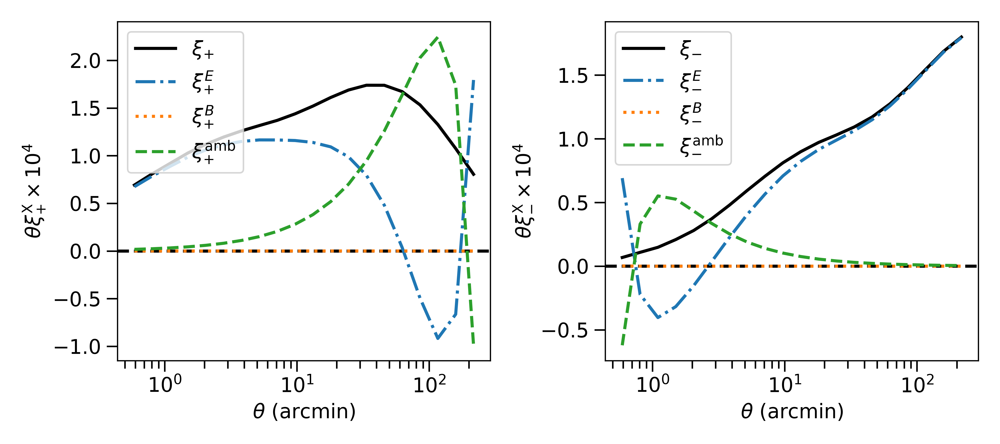

# Summary

Weak gravitational lensing is a widely used probe in cosmological analysis. It
allows astrophysists to understand the content and evolution of the Universe.
We are entering an era where we are not limited by the data volume but by
systematic uncertainties. It is in this context that we present here a simple
python-based software package to help in the computation of E-/B-mode
decomposition, which can be use for systematic checks or science analysis. As
we demonstrate, our implementation has both the high precision required and
speed to perform this kind of analysis while avoiding a scenario wherein either
numerical precision or computational time is a significant limiting factor.

# Statement of need

The E-/B-mode composition for cosmic shear poses a significant computational
challenge given the need for high precision (required to integrate oscillatory
functions over a large integration range and achieve accurate results) and
speed. `Cosmo-numba` meets this need, facilitating the computation of
E-/B-mode decomposition using two methods. One of them is the Complete
Orthogonal Sets of E-/B-mode Integrals (COSEBIs) as presented in
@Schneider_2010. The COSEBIs rely on very high precision computation requiring
more than 80 decimal places. @Schneider_2010 propose an implementation using
`mathematica`. `cosmo-numba` uses a combination of `sympy` and `mpmath` to
reach the required precision. This python version enables an easier integration
within cosmological inference pipelines, which are commonly python-based, and
facilitates the null tests.

This software package also enables the computation of the  pure-mode
correlation functions presented in @Schneider_2022. Those integrals are less
numerically challenging than the COSEBIs, but having a fast computation is
necessary for their integration in an inference pipeline. Indeed, one can use
those correlation functions for cosmological inference, in which case the large
number of calls to the likelihood function will require a fast implementation.

# State of the field

There are other implementations of the COSEBIs such as CosmoPipe[^1] used in
the KiDS-legacy analysis [@kids_legacy]. Our implemetation is characterized by
the use of `numba` that makes the computation of the filter functions described
in \autoref{sec:cosebis} faster. Regarding the pure E-/B-mode decomposition we
have not find a similar publicly available implementation. That being said,
they are classicaly used as a one time measure for null tests in various
surveys. The implementation we are presenting would enable one to use this
decomposition for cosmological inference that requires computing several
integrals at each likelyhood call. While commonly used library such as
`Scipy` would make the computation untrackable, the speed gain by switching to
`numba` open new perspectives such as this one.

[^1]: <https://github.com/AngusWright/CosmoPipe>

# Software design

This package has been designed around two constraints: precision and speed. As
it can be difficult to reach both at the same time, the code is partitioned in
a way that parts requiring high precision are done using python library such as
`sympy` and `mpmath`. While parts of the code that do not require high
precision leverage the power of Just-In-Time (JIT) compilation. `Numba`
provides significant speed up compare to a classic python implementation.
As this library is entended to provide tools from cosmological computation, it
was important to provide meaningful unit tests and demonstrate a full coverage
of the library. Providing an accurate coverage is challenging when using
`numba` compiled code. Our implementation allows to disbale compilation for
tageted part of the code when performing coverage tests. This allows us to
provide both high quality unit tests and good coverage to the users.

# Testing setup

In the following two sections we make use of fiducial shear-shear correlation
functions, $\xi_{\pm}(\theta)$, and power spectrum, $P_{E/B}(\ell)$. They have
been computed using the Core Cosmology Library[^2] [@Chisari_2019].
The cosmological parameters are taken from @Planck_2018. For tests that
involved covariance we are using the Stage-IV Legacy Survey of Space and Time
(LSST) Year 10 as a reference. The characteristics are taken from the LSST Dark
Energy Science Collaboration (DESC) Science Requirements Document (SRD)
[@LSST_SRD].

[^2]: <https://github.com/LSSTDESC/CCL>

# COSEBIs

\label{sec:cosebis}

The COSEBIs are defined as:

\begin{equation}
E_{n} = \frac{1}{2} \int_{0}^{\infty} d\theta\, \theta [T_{n,+}(\theta)\xi_{+}(\theta) + T_{n,-}(\theta)\xi_{-}(\theta)],
\end{equation}
\begin{equation}
B_{n} = \frac{1}{2} \int_{0}^{\infty} d\theta\, \theta [T_{n,+}(\theta)\xi_{+}(\theta) - T_{n,-}(\theta)\xi_{-}(\theta)];
\end{equation}

where $\xi_{\pm}(\theta)$ are the shear correlation functions, and $T_{n,\pm}$
are the weight functions for the COSEBI mode $n$. The complexity is in the
computation of the weight functions. `Cosmo-numba` carries out the computation
of the weight functions in a logarithmic scale defined by:

\begin{equation}
T_{n,+}^{\rm{log}}(\theta) = t_{n,+}^{\rm{log}}(z) = N_{n}\sum_{j=0}^{n+1}\bar{c}_{nj}z^{j};
\end{equation}

whare $z = \rm{log}(\theta/\theta_{\rm{min}})$, $N_{n}$ is the normalization
for the mode $n$, and $\bar{c}_{jn}$ are defined iteratively from Bessel
functions (we refer the readers to @Schneider_2010 for more details).

We have validating our implementation against the original version in
`Mathematica` from @Schneider_2010. In \autoref{fig:Tpm_prec} we show
the impact of the precision going from 15 decimal places, which corresponds to
the precision one could achieve using float64, up to 80 decimal places, the
precision used in the original `Mathematica` implementation. We can see that
classic float64 precision would not be suficient, and with a precision of 80
our code exactly recovers the results from the original implementation. Given
that the precision comes at very little computational cost, we default to the
original implementation using high precision.
The impact of the precision propagated to the COSEBIs is shown in
\autoref{fig:EB_prec}. We can see that using a lower precision than the default
setting can incur a several percent error.

![In this figure we show the impact of the precision in the computation of the weight functions $T_{\pm}^{\rm{log}}$. For comparion, a precision of 15 corresponds to what would be achieved using `numpy` float64. The difference is computed with respect to the original `Mathematica` implementation presented in @Schneider_2010. The figure uses symlog, with the shaded region representing the linear scale in the range $[-10^{-15}, 10^{-15}]$.\label{fig:Tpm_prec}](cosebis_prec_Tpm.png)

![This figure shows the difference in the COSEBIs E- and B-modes relative to the original `Mathematica` implementation. We see that using only 15 decimal places would lead to several percent error, making an implementation based on `numpy` float64 not suitable. The figure uses symlog, with the shaded region representing the linear scale in the range $[-1,1]$ percent.\label{fig:EB_prec}](cosebis_prec_EB.png)

COSEBIs can also be defined from the power spectrum as:

\begin{equation}
E_{n} = \int_{0}^{\infty} \frac{d \ell \, \ell}{2 \pi} P_{E}(\ell)W_{n}(\ell);
\end{equation}
\begin{equation}
B_{n} = \int_{0}^{\infty} \frac{d \ell \, \ell}{2 \pi} P_{B}(\ell)W_{n}(\ell);
\end{equation}

where $P_{E/B}(\ell)$ is the power spectrum of E- and B-modes and $W_{n}(\ell)$
are the filter functions which can be computed from $T_{n,+}$ as:

\begin{equation}\label{eq:Wn}
W_{n}(\ell) = \int_{\theta_{\rm{min}}}^{\theta_{\rm{max}}} d\theta \,\theta T_{n,+}(\theta) J_{0}(\ell\theta);
\end{equation}

with $J_{0}(\ell \theta)$ the 0-th order Bessel function. The \autoref{eq:Wn}
is a Hankel transform of order 0. It can be computed using the `FFTLog`
algorithm presented in @Hamilton_2000 implemented here in `Numba`.
\autoref{fig:cosebis_xi_cl} shows the comparison between the COSEBIs computed
from $\xi_{\pm}(\theta)$ and from $C_{E/B}(\ell)$. We can see that the COSEBI
E- & B-modes agree very well, with at most $0.3\sigma$ difference with
respect to the LSST Y10 covariance. We consider that using either approach
would not impact the scientific interpretation and both could be used for
consistency checks.

Finally, we have compared our implementation agains CosmoPipe[^3] which make
use of a different integration method to compute the filter functions suche as
Levin integration. We found that our implementation using numba is around 100
times faster for equivalent precision.

[^3]: The test has been done on a Mac M3 Max using 16 cores. The script to run
the test is available at: !!!LINK HERE!!!

# Pure-Mode Correlation Functions

In this section we describe the computation of the pure-mode correlation
functions as defined in @Schneider_2022. There are defined as follow:

\begin{equation}
\xi_{+}^{E}(\vartheta) = \frac{1}{2} \left[ \xi_{+}(\vartheta) + \xi_{-}(\vartheta) + \int_{\vartheta}^{\vartheta_{\rm{max}}} \frac{d \theta}{\theta} \xi_{-}(\theta) \left( 4 - \frac{12\vartheta^{2}}{\theta^{2}} \right) \right] - \frac{1}{2} \left[ S_{+}(\vartheta) + S_{-}(\vartheta)\right],
\end{equation}
\begin{equation}
\xi_{+}^{B}(\vartheta) = \frac{1}{2} \left[ \xi_{+}(\vartheta) - \xi_{-}(\vartheta) - \int_{\vartheta}^{\vartheta_{\rm{max}}} \frac{d \theta}{\theta} \xi_{-}(\theta) \left( 4 - \frac{12\vartheta^{2}}{\theta^{2}} \right) \right] - \frac{1}{2} \left[ S_{+}(\vartheta) - S_{-}(\vartheta)\right],
\end{equation}

\begin{equation}
\xi_{-}^{E}(\vartheta) = \frac{1}{2} \left[ \xi_{+}(\vartheta) + \xi_{-}(\vartheta) + \int_{\vartheta_{\rm{min}}}^{\vartheta} \frac{d \theta\~\theta}{\vartheta^{2}} \xi_{+}(\theta) \left( 4 - \frac{12\theta^{2}}{\vartheta^{2}} \right) \right] - \frac{1}{2} \left[ V_{+}(\vartheta) + V_{-}(\vartheta)\right],
\end{equation}
\begin{equation}
\xi_{-}^{B}(\vartheta) = \frac{1}{2} \left[ \xi_{+}(\vartheta) - \xi_{-}(\vartheta) + \int_{\vartheta_{\rm{min}}}^{\vartheta} \frac{d \theta\~\theta}{\vartheta^{2}} \xi_{+}(\theta) \left( 4 - \frac{12\theta^{2}}{\vartheta^{2}} \right) \right] - \frac{1}{2} \left[ V_{+}(\vartheta) - V_{-}(\vartheta)\right];
\end{equation}

where $\xi_{\pm}(\theta)$ correspond to the shear-shear correlation function.
The functions $S_{\pm}(\theta)$ and $V_{\pm}(\theta)$ are themselves defined
by integrals and we refer the reader to @Schneider_2022 for more details about
their definition. By contrast with the computation of the COSEBIs, these
integrals are more stable and straightforward to compute but still require
some level of precision. This is why we are using the `qags` method from
QUADPACK[^2] [@piessens2012quadpack] with a 5th order spline interpolation.
In addition, as one can see from the equations above, the implementation
requires a loop over a range of $\vartheta$ values. This is why having a fast
implementation will be required if one wants to use those correlation functions
in cosmological inference. In \autoref{fig:pure_EB} we show the decomposition
of the shear-shear correlation function into the E-/B-modes correlation
functions and ambiguous mode.

To asses the speed improvement of our implementation, we have run the same
computation using `Scipy` functions: `CubicSpline` for the interpolation and
`quad` for the integration[^4]. While the precision is comparable, our serial
version is more than 8 time faster while the parallel version is more than 50
times faster.

[^4]: The test has been done on a Mac M3 Max using 16 cores. The script to run
the test is available at: !!!LINK HERE!!!

# Research impact statement

This software is being in the Utraviolet Near Infrared Optical Northern Survey
(UNIONS) to validate the catalogue used for cosmological analysis (REF: Daley
et al. 2026).We are also planning to use this code in the Roman High Latitude
Imaging Survey (HLIS). In addition its current usage in science collaborations,
we provide unit tests that not only validate the implementation but also
validate the computation mathematically and provide a higher bound for the
accuracy of the code. Fianlly, examples can be found in the code repo that
provide comparison against alternative approach and implementation. They show
that the computation presented here is significantly faster than existing
alternatives.

# AI usage disclosure

Artificial Intelligence (AI) has been use to help with documentation,
docstrings and for some of the unit tests.

# Acknowledgements

The authors acknowledge the support of a grant from the Simons Foundation
(Simons Investigator in Astrophysics, Award ID 620789).

# References
